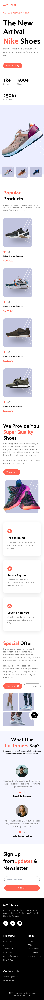

# Nike Landing Page

Nike landing page is built using React and Tailwindcss. I created this project as a part my learning tailwindcss by following [Javascript Mastery](https://www.youtube.com/watch?v=tS7upsfuxmo&t=464s) youtube video.

## Live Demo

[Nike Landing Page](https://nike-landingpage-tailwindcss.netlify.app/)

## Screenshots

- Desktop View

- Mobile View

## Lessons Learned

- What is Tailwindcss
- How to use tailwindcss utility classes
- How to step up tailwind with React using Vite

